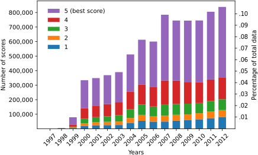

# EML4U Drift Detector Comparison


## Installation notes

For specific software versions, check the requirements.txt

Uses embedding/BertHuggingface from https://github.com/UBI-AGML-NLP/Embeddings at version 1.0

```python
cd /path/to/Embeddings/
git checkout 1.0
pip3 install -U .
```

### Alibi Detect

```python
# Erros with tensorflow 2.4.1 and 2.3.0
pip3 uninstall tensorflow
pip3 install -U tensorflow==2.4.0

pip3 install alibi-detect==0.7.0
pip3 install nlp
```

### Activate an environment (example)

```python
conda info --envs
conda activate EML4U
```

## Dataset: Amazon movie reviews




## How to run these experiments

### Data access

Download the Amazon and Twitter base datasets
- Amazon: https://snap.stanford.edu/data/web-Movies.html
    - location: data/movies/movies.txt.gz and data/movies/movies.txt
    
- Twitter: https://www.kaggle.com/manchunhui/us-election-2020-tweets
    - location: data/twitter/hashtag_donaldtrump.csv and data/twitter/hashtag_joebiden.csv

### Data preparation

#### Amazon

- run amazon_movie_sorter.py
    - Sorts datasets by helpfulness.score.time and saves it along with text.
    - In: data/movies/movies.txt.gz
    - Out: data/movies/embeddings/**amazon_raw.pickle**
    
#### Twitter

- filter_tweets.py
    - Converts the tweets into a more easily readable format and filters out malformed data points
    - In: hashtag_joebiden.csv
    - In2: hashtag_donaldtrump.csv
    - Out: **election_dataset_raw.pickle**   
    
    
### Model preparation

#### BERT

- finetune_amazon_bert_768.py
    - finetunes a BERT model for 10 epochs and saves each one
    - In: data/movies/embeddings/amazon_raw.pickle
    - Out: data/movies/movie_{1-9}e/
    
    
#### BoW

- word2vec/doc2vec.py
    - creates a BoW model for amazon data
    
- word2vec/doc2vec_twitter_election.py
    - creates a BoW model for the twitter data
    
    
### Embedding generation

- generate_all_the_datasets.py
    - generates all embeddings for all models and datasets in a predetermined order via seperate scripts
    - see inside the scripts for more detail
    
    
### Experiments

#### Amazon

- Run (in any order)
    - amazon_different_classes.ipynb
    - amazon_same_dist.ipynb
    - amazon_drift_induction.ipynb

#### Twitter

- Run (in any order)
    - twitter_different_classes.ipynb
    - twitter_same_dist.ipynb
    - twitter_drift_induction.ipynb
    - twitter_different_dist.ipynb
    
### Figures

- Run evaluation/plots_injection.ipynb and evaluation
    - this will create the basic figures used in the paper
    
- Run evaluation/figure-diff_dist-results.sh and evaluation/figure-injection-results.sh
    - this will merge the figures to what you see in the paper
    
- Run evaluation/tweet_count_gen.ipynb
    - this will create Figure 1 of the paper